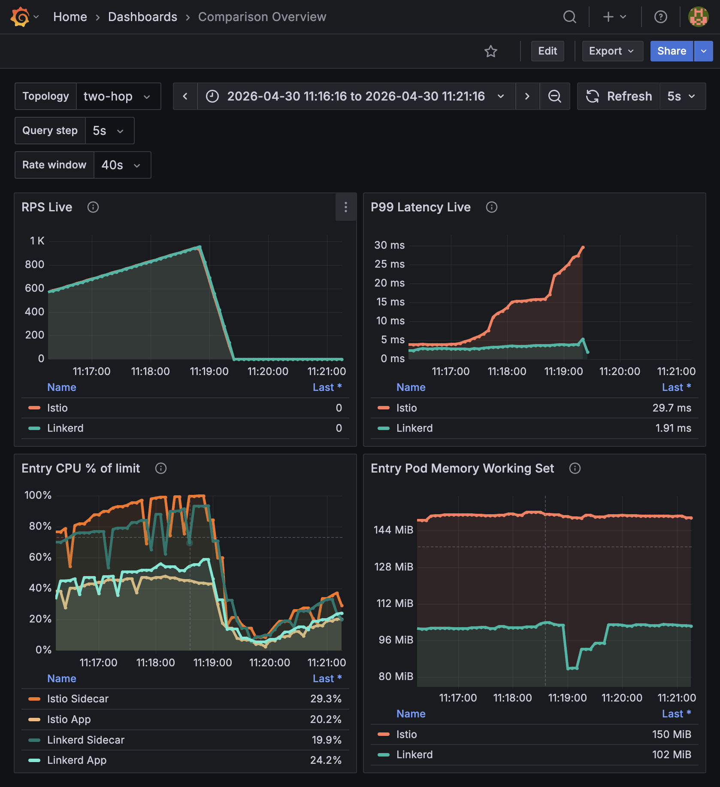
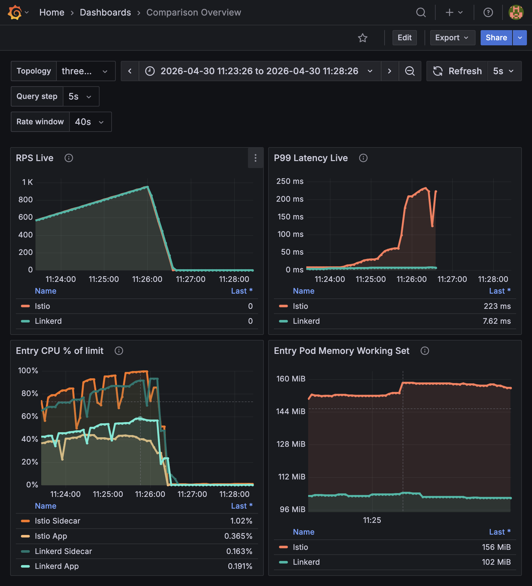

# Service Mesh Benchmark

Reproducible benchmark environment for measuring the real performance and operational cost of service mesh on .NET HTTP microservices. The project compares Istio and Linkerd across `two-hop` and `three-hop` topologies, drives deterministic load with k6, and consolidates RPS, P99, CPU, and memory with Prometheus and Grafana.

## Project overview

This repository provides a reproducible benchmark environment for comparing the operational and performance cost of two service meshes on .NET HTTP microservices: Istio and Linkerd. The environment has already been validated in a `3 VPS` layout, with one node dedicated to each mesh and a third `control-plane` node hosting Grafana and k6. The applications in scope are `service-entry`, `service-middle`, `service-leaf`, and `benchmark-runner`, and the official benchmark topologies are `two-hop` and `three-hop`.

The main dashboard is `comparison-overview`, which exposes live readings for RPS, P99, CPU, and memory. Its active variables are `topology`, `query_step`, and `rate_window`. In practice, the validated operating rule is straightforward: `query_step=5s` works well for visual resolution, but `rate_window` must remain on safe windows of `15s` or more. The currently validated default for stable rate-based charts is `40s`.

The reference run consolidated in this README is `2026-04-30T14:11:36Z`. The main artifacts behind that reading are:

- Executive report: [results/reports/benchmark-progress-20260430/relatorio-leitura-prints.md](results/reports/benchmark-progress-20260430/relatorio-leitura-prints.md)
- Structured measurements: [results/reports/benchmark-progress-20260430/measurements.json](results/reports/benchmark-progress-20260430/measurements.json)
- Visual gallery: [results/reports/benchmark-progress-20260430/galeria-screenshots.md](results/reports/benchmark-progress-20260430/galeria-screenshots.md)
- Additional `two-hop` evidence for the `11:55:00` to `12:02:30` window: [results/reports/benchmark-progress-20260430/evidencias-two-hop-20260430-115500-120230.md](results/reports/benchmark-progress-20260430/evidencias-two-hop-20260430-115500-120230.md)

## Why this benchmark exists

Microservices usually improve team autonomy and scaling flexibility, but they also move a significant part of the system complexity into the network. Instead of in-process calls, the application becomes dependent on distributed request chains such as:

```text
client -> service A -> service B -> service C
```

Once that happens, latency, partial failures, observability, and service identity stop being secondary concerns. They become part of the application behavior itself. A service mesh appears precisely at that point: it inserts a standardized communication layer between services, usually in the form of:

```text
service -> proxy -> network -> proxy -> service
```

That layer can improve communication consistency, security, observability, and traffic control. In exchange, it also adds CPU cost, memory cost, extra latency per hop, and operational complexity. The purpose of this benchmark is to measure that trade-off in a controlled environment, using the same application, the same load methodology, and the same base resource profile for both meshes.

## When a mesh makes sense

In environments with many services, strong service-to-service security requirements, richer observability needs, and advanced traffic policy demands, a mesh often makes sense because it removes distributed infrastructure concerns from application code. In smaller systems, with only a few services and lower operational complexity, the equation can invert: the added platform cost becomes larger than the value it generates.

That is why the first architectural question is not only which mesh to adopt, but whether the system needs a mesh at all. Only after that decision does it make sense to compare which model offers the best balance between control and overhead.

## How to read Istio and Linkerd in this comparison

This repository compares two distinct philosophies. Istio prioritizes control surface, advanced policy enforcement, and deeper traffic governance. That makes it a stronger fit for complex environments, platform-mature teams, and scenarios with demanding governance requirements. The trade-off is that operational cost and runtime overhead tend to be more visible, and metric interpretation requires more care when separating application behavior from sidecar behavior.

Linkerd follows a leaner direction. It emphasizes simpler operation, smaller configuration surface, and lower incremental cost. That usually makes it a better fit for teams that want mesh-level security and observability without adopting the same operational weight of a broader platform. The trade-off is reduced flexibility in scenarios that require more advanced traffic or policy controls.

## Reference benchmark

The validated run used as the baseline for this README was executed with the following parameters:

- Start time: `2026-04-30T14:11:36Z`
- Profile: `video1000`
- Warm-up: `20s` at `100 RPS`
- Ignored phase: `10s`
- Measurement: ramp from `0` to `1000 RPS` in `100 RPS` steps
- Step duration: `40s`
- Dashboard settings: `query_step=5s`, `rate_window=40s`, `5m` visual window

This configuration was chosen to represent a progressive ramp toward high load while preserving enough signal to compare throughput, latency, and resource cost at the same points in time.

### How to interpret the graphs

The four most important panels should be read together. `RPS Live` shows whether final throughput remains close across the two meshes. `P99 Latency Live` exposes the real quality of response under pressure. `Entry CPU % of limit` separates application CPU from sidecar CPU, which is the most important distinction for locating saturation. `Entry Pod Memory Working Set` complements that reading with the aggregate footprint of the entry pod.

When these four signals are combined, the dashboard stops answering only “which mesh delivered more throughput” and starts answering the more useful question: which mesh sustained the same load with lower cost and better tail latency.

### Consolidated snapshot

#### two-hop

| Indicator | Istio | Linkerd |
| --- | ---: | ---: |
| Final-stage RPS | 946.0 | 943.7 |
| Final-stage P99 | 17.20 ms | 3.63 ms |
| Final-stage sidecar CPU | 99.9% | 93.4% |
| Final-stage app CPU | 43.6% | 56.4% |
| Final-stage entry pod memory | 150.9 MiB | 102.8 MiB |

#### three-hop

| Indicator | Istio | Linkerd |
| --- | ---: | ---: |
| Final-stage RPS | 943.5 | 941.0 |
| Final-stage P99 | 208.69 ms | 7.40 ms |
| Final-stage sidecar CPU | 99.7% | 72.2% |
| Final-stage app CPU | 38.9% | 57.0% |
| Final-stage entry pod memory | 158.2 MiB | 104.4 MiB |

### Visual evidence

#### two-hop at the final stage



#### three-hop at the final stage



### Reading the results

The results show that throughput alone does not explain the behavioral difference between the two meshes. At the final stages, Istio and Linkerd finish with very similar RPS across both topologies. The meaningful divergence appears in P99, especially in `three-hop`, where Istio degrades much more aggressively. This pattern indicates that the application still delivers volume, but at a much higher tail-latency cost.

When P99 is read together with CPU and memory, the picture becomes clearer. Entry pod memory remains consistently higher on Istio, and the mesh cost becomes more visible as the request chain grows from `two-hop` to `three-hop`. That reinforces the central point of the benchmark: dataplane impact is not constant; it becomes more visible as the flow gains more hops and more proxy work per request.

### CPU, sidecar limit, and machine size

The official resource profile for this comparison is fixed and identical across both meshes:

- application: `100m` request, `1000m` limit, `128Mi` request, `256Mi` limit
- sidecar: `50m` request, `500m` limit, `64Mi` request, `128Mi` limit
- replicas per service: `1`

Under that profile, the current evidence points more strongly to Istio sidecar saturation than to a direct proof of node-wide VPS CPU exhaustion. In `two-hop`, the Istio sidecar ends at `99.9%` of its limit while the application remains at `43.6%`. In `three-hop`, the sidecar ends at `99.7%`, the application remains at `38.9%`, and P99 rises to `208.69 ms`. Under the same methodology and the same resource profile, Linkerd keeps a much lower P99 and does not reproduce the same proportional degradation in `three-hop`.

That does not fully rule out machine size as a contributing factor. A VPS with little headroom for kubelet, Prometheus, CNI, ingress, and local control-plane work can amplify the issue. Even so, the current evidence supports a more precise statement: the primary degradation signal is Istio dataplane cost hitting the sidecar `500m` CPU limit. The repository keeps methodological parity between meshes, but it does not version the exact `vCPU` and memory profile of the VPS nodes; because of that, “small machine” remains a plausible secondary hypothesis, not the main conclusion.

### Architectural takeaway

The benchmark converges toward a practical conclusion. Service mesh cost is real, measurable, and grows with hop count, so it must be treated as an explicit architectural variable from the start. Choosing between Istio and Linkerd is therefore not an abstract right-versus-wrong discussion, but a trade-off decision across control, flexibility, operational simplicity, and overhead.

Before adopting any mesh, the right question is still this:

```text
Do you really need a service mesh?
```

If the answer is yes, this benchmark helps determine which mesh model aligns better with the amount of operational and performance cost your environment can absorb.

## Quick start on an Ubuntu VPS

```sh
chmod +x setup.sh
./setup.sh
```

The script asks only for a sudo user and password using secure input. By default it prepares an Ubuntu VPS with Docker, k3s, Istio or Linkerd, k6, firewall rules, image builds, service deployment, observability, and, in `single-node` mode, a benchmark run.

The same `setup.sh` also supports a `3 VPS` layout with role-based idempotent provisioning:

- `SETUP_ROLE=istio-node`: provisions the Istio application node with app workloads, k3s, Istio, and Prometheus.
- `SETUP_ROLE=linkerd-node`: provisions the Linkerd application node with app workloads, k3s, Linkerd, and Prometheus.
- `SETUP_ROLE=control-plane`: provisions the coordination node with Grafana and k6, targeting remote benchmark endpoints and Prometheus APIs. In this role, the benchmark is not started automatically by default.

Operational premise: the script configures only the VPS local firewall through `ufw`. If your provider uses an external firewall, security group, edge ACL, or NAT policy, public access to ports `30080`, `30081`, `30090`, and `30300` must be opened outside the script.

Useful parameters:

```sh
MESH=istio ./setup.sh
MESH=linkerd TARGET_ENDPOINT=http://127.0.0.1:30080/invoke ./setup.sh
VERBOSE=1 ./setup.sh
```

Example for `3 VPS`:

```sh
SETUP_ROLE=istio-node VERBOSE=1 ./setup.sh
SETUP_ROLE=linkerd-node VERBOSE=1 ./setup.sh
SETUP_ROLE=control-plane \
ISTIO_VPS_IP=10.0.0.11 \
LINKERD_VPS_IP=10.0.0.12 \
VERBOSE=1 ./setup.sh
```

On the `control-plane` role, you can also set the remote URLs explicitly:

```sh
SETUP_ROLE=control-plane \
ISTIO_TARGET_ENDPOINT=http://10.0.0.11:30080/invoke \
LINKERD_TARGET_ENDPOINT=http://10.0.0.12:30082/invoke \
ISTIO_PROMETHEUS_API=http://10.0.0.11:30090/api/v1/query \
LINKERD_PROMETHEUS_API=http://10.0.0.12:30090/api/v1/query \
./setup.sh
```

To force a benchmark run during `control-plane` setup, set `RUN_BENCHMARK_ON_SETUP=1`. By default, the control-plane only provisions the environment and leaves it ready.

After the `control-plane` is provisioned, run the benchmark explicitly:

```sh
ISTIO_TARGET_ENDPOINT=http://10.0.0.11:30080/invoke \
LINKERD_TARGET_ENDPOINT=http://10.0.0.12:30082/invoke \
ISTIO_PROMETHEUS_API=http://10.0.0.11:30090/api/v1/query \
LINKERD_PROMETHEUS_API=http://10.0.0.12:30090/api/v1/query \
MESH=all ./scripts/run-benchmark.sh
```

After `30300/tcp` is allowed on the provider side, Grafana is available at `http://<vps-public-ip>:30300`.

## Local development

```sh
dotnet restore
dotnet test service-mesh.sln
dotnet run --project apps/service-entry
dotnet run --project apps/service-middle
dotnet run --project apps/service-leaf
dotnet run --project apps/benchmark-runner
```

## Layout

- `apps/`: .NET runner and microservices.
- `infra/`: Kubernetes manifests, Istio/Linkerd overlays, observability, and environment scripts.
- `load/k6/`: official load scenarios.
- `scripts/`: build, deploy, benchmark, and Ubuntu provisioning automation.
- `results/runs/`: structured run results.
- `results/reports/`: executive reports, structured measurements, and visual evidence.
- `specs/`: Speckit artifacts.

## Official metrics and operational notes

- Primary P99 source: k6.
- Secondary RPS, CPU, and memory source: Prometheus.
- The current Prometheus scrape cadence is effectively `5s`.
- For that reason, `rate_window=5s` is not reliable on panels that depend on `rate(...)`.
- The validated dashboard setup keeps `query_step=5s` for visual resolution and `rate_window=40s` for stable calculations.